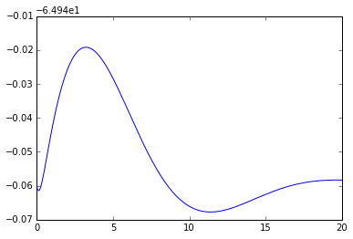
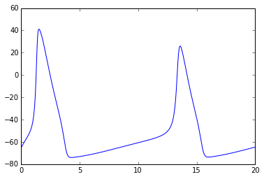
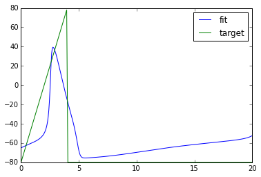

### Introduction

[XPPAUT](http://www.math.pitt.edu/~bard/xpp/xpp.html) is a great
software for the analysis of dynamical systems. Many mathematical models
have been implemented with XPPAUT (\*.ODE file format) \[search for
examples at <http://senselab.med.yale.edu/modeldb/>\]. These
implementations could be used to reproduce computational experiments and
to quickly test ideas related to them. For instance, one could perform
the sensitivity analysis of model’s parameters or parameters’ space
searches. However, due to the graphical nature of XPPAUT, the batch
modification of parameters of these models is problematic. 

Here I describe the solution for this problem using simple python module
**Py\_XPPCALL** that I have written to interface with XPPAUT. It allows
you to batch-modify model’s parameters and returns corresponding
solutions. An analogous software exists,
<https://github.com/jsnowacki/xppy>, however little documentation is
available.

Py\_XPPCALL is easy to use and does not require installation. Simply put
**xppcall.py** to your python path or current folder.

### Features
We pay particular attention to the easy modification of input options, initial conditions, parameters, and the intuitive access to output data. In particular, within python you can:
* Modify scalar or array initial conditions
* Modify parameters and numerics options
* Grab output data for each state variable

These features allow users to take full advantage of the existing scientific libraries in python for data manipulation. In fact the abilities are virtually identical to those listed in the matlab-xpp interface website <http://www2.gsu.edu/~matrhc/XPP-Matlab.html>. Here they are, verbatim:

(a) If you are not an advanced XPP user, and you don't understand how to set up multi-parameter / initial condition (I.C.) range integration batch jobs in XPP, or you find doing so too fussy and prone to mistakes. You may want to vary more than 2 parameters or I.C.s. without specifying a large table of pre-determined values within XPP, or you want to allow a user to set up the ranges interactively in Matlab.

(b) Furthermore, you might want to run Matlab scripts that adaptively select parameter values or I.C.s based on the results of previous XPP integration results (e.g. parameter estimation algorithms, "shooting" methods, etc.).

(c) You can do data analysis on the integrated orbits without writing dynamic link libraries (usually in C) that are called from within your .ode script. (Some institutional installations of XPP may not have been done with the DLL option set, which can be a problem.) Also, you can take advantage of Matlab's built-in statistical tools and visualization capabilities.

(d) You don't need an X server on a Windows platform to run XPP in silent mode, so I guess these functions might make XPP a little more usable in the event that you don't have a working X server in Windows!

### Examples
Please see the several python example files for syntax usage. We also comment the xppcall.py file extensively.

#### An example of usage with Hodgkin-Huxley neuron model for numerical optimization

I extracted the ODE source code of Hodgkin-Huxley model  from the
example at the website of
XPPAUT <http://www.math.pitt.edu/~bard/bardware/tut/newstyle.html#hh>. I
saved it as hh.ode. I put it to the same folder where I have xppcall.py
and ran python from there. 

``` {.python}
## Py_XPPCALL Example

# import some modules including Py_XPPCALL
import matplotlib.pylab as plt
import numpy as np
from xppcall import xpprun, read_pars_values_from_file

# Let's check what are the parameters of the model
pars = read_pars_values_from_file('hh.ode')
print pars
```

``` {style="line-height:16.25px;color:rgb(0,0,0)"}
Out[]: 

    {'c': '1',
     'gk': '36',
     'gl': '.3',
     'gna': '120',
     'i': '0',
     'vk': '-77',
     'vl': '-54.4',
     'vna': '50'}
```

``` {.python}
# Note: XPPAUT is not case sensitive. In Py_XPPCALL, the names of parameters and variables were chosen to be in lower case.

# Let's plot solution for membrane potential with parameters specified in .ODE file
npa, vn = xpprun('hh.ode', clean_after=True)
plt.figure()
plt.plot(npa[:,0], npa[:, 1+vn.index('v')])
```

``` {style="line-height:16.25px;color:rgb(0,0,0)"}
Out[]:
```

[](py_xppcall-a-python-binding-to-xppaut/1.png)

``` {.python}
# Let's modify constant input current
npa, vn = xpprun('hh.ode', parameters={'i':20.0}, clean_after=True)
plt.figure()
plt.plot(npa[:,0], npa[:, 1+vn.index('v')])
```

``` {style="line-height:16.25px;color:rgb(0,0,0)"}
Out[]:
```

[](py_xppcall-a-python-binding-to-xppaut/2.png)

``` {.python}
# Example of an optimization using fmin from SciPy
from scipy.optimize import fmin

# define desired V graph
target_v = -80.0+20*npa[:,0]*(np.sign(-npa[:,0]+4)+1)
plt.figure()
plt.plot(npa[:,0], target_v)
```

``` {style="line-height:16.25px;color:rgb(0,0,0)"}
Out[]:
```

``` {.python}
# define objective_func we want to minimize
def objective_func(x, target=target_v):
    try:
        npa, vn = xpprun('hh.ode', parameters={'i':x[0]}, clean_after=True)
        computed = npa[:, 1+vn.index('v')]
        return np.mean( (computed-target)**2 )
    except:
        return 1e10 # return huge error if something went wrong

xopt = fmin(objective_func, [20.0]) # find new parameters
npa, vn = xpprun('hh.ode', parameters={'i':xopt[0]}, clean_after=True)
plt.figure()
plt.plot(npa[:,0], npa[:, 1+vn.index('v')], label='fit')
plt.plot(npa[:,0], target_v, label='target')
plt.legend()
```

``` {style="line-height:16.25px;color:rgb(0,0,0)"}
Out[]:
```



### Congrats! We got a pretty good fit.
